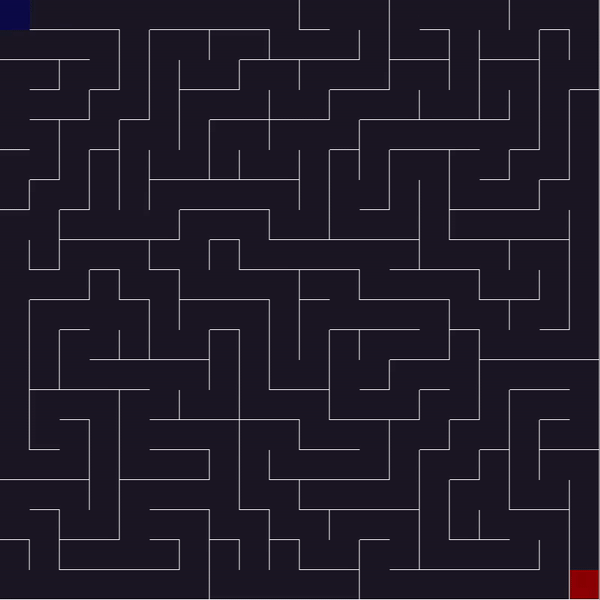

# Maze game

## General info

This is a C++ program that generates a maze using an iterative implementation of depth-first search algorithm and then lets user play a maze game.

## Keyboard Controls

* `LEFT` - move left
* `RIGHT` - move right
* `UP` - move up
* `DOWN` - move down
* `ESC` - exit

## Example gameplay

 

